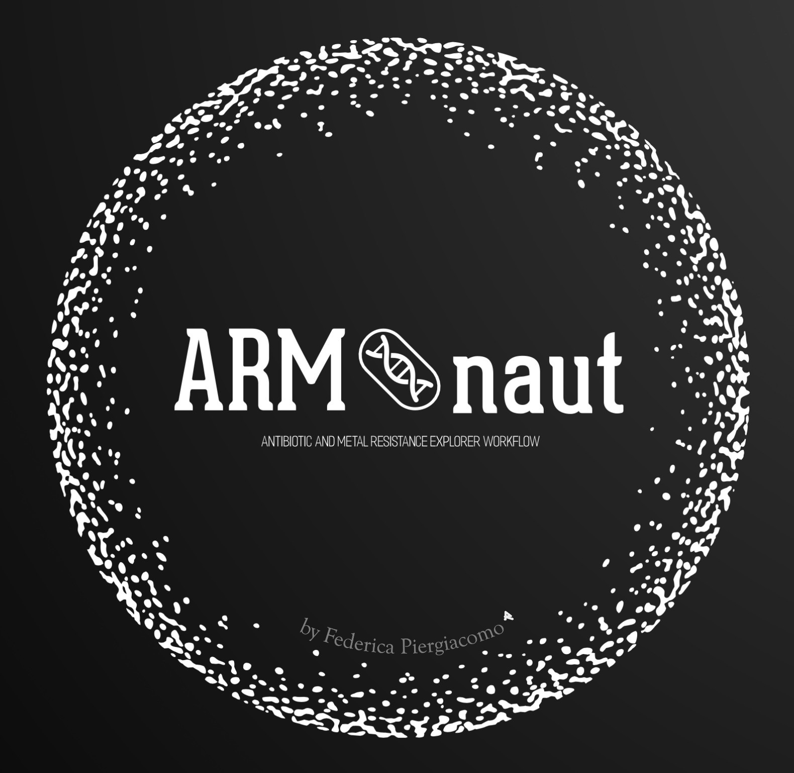

<p align="center">
  
</p>

# 🧬 ARMonaut
**Antibiotic & Metal Resistance Annotation Explorer Workflow**  
Developed by *Federica Piergiacomo*, Free University of Bozen-Bolzano.

[](https://www.nextflow.io/)
[](LICENSE)
[](https://github.com/FedPierg/ARMonaut/releases)
[](https://sylabs.io/singularity/)
[](https://www.docker.com/)
[](https://doi.org/10.5281/zenodo.18187986)
---

## 📑 Table of Contents
- [Overview](#-overview)
- [Workflow Modules](#-workflow-modules)
- [Automatic Database Setup](#-automatic-database-setup)
- [Requirements](#-requirements)
- [Installation](#-installation)
- [Quick Start](#-quick-start)
- [Input / Output](#-input--output)
- [Citation](#-citation)
- [License](#-license)
- [Acknowledgments](#-acknowledgments)

---

### 🌍 Overview
**ARMonaut** is a modular workflow designed for the annotation of:
- **Antibiotic resistance genes (ARGs)** with **RGI + CARD**
- **Metal resistance genes (MRGs)** with **DIAMOND + BacMet 2.0**
- **Plasmid replicons** with **PlasmidFinder**
- **rRNA genes (16S)** with **Barrnap**
- **Protein-coding genes** with **Prokka**

It supports both **local** and **HPC (SLURM)** execution and can run seamlessly using **Singularity** or **Docker** for maximum reproducibility and portability.

---

### 🧩 Workflow Modules

| Module | Function | Tools |
|:--------|:----------|:------|
| 1️⃣ RGI Annotation | Identify antibiotic resistance genes | RGI, CARD |
| 2️⃣ BacMet Annotation | Identify metal resistance genes | DIAMOND, BacMet2 |
| 3️⃣ Barrnap 16S | Detect rRNA genes (16S) | Barrnap |
| 4️⃣ PlasmidFinder | Detect plasmid replicons | PlasmidFinder |
| 5️⃣ Prokka | Annotate protein-coding genes | Prokka |

All modules can be executed **independently** or within the **Nextflow** pipeline.

---

### 📦 Automatic Database Setup
ARMonaut automatically downloads and configures the necessary databases:  

| Database | Used by | Source |
|:----------|:--------|:--------|
| CARD | RGI | [card.mcmaster.ca](https://card.mcmaster.ca/latest/data) |
| BacMet2 | BacMet | [Zenodo](https://zenodo.org/records/7577664) |
| PlasmidFinder | PlasmidFinder | [Bitbucket](https://bitbucket.org/genomicepidemiology/plasmidfinder_db) |

They are stored automatically under:
```
databases/
├── card_db/
├── bacmet2/
└── plasmidfinder_db/
```

---

### 🧠 Requirements
- Linux or macOS
- Nextflow ≥ 23.10 (tested with 23.10.1)
- [Singularity ≥ 3.9](https://sylabs.io/singularity/) *or* [Docker](https://www.docker.com/)
- Optional: SLURM for HPC clusters
- ≥ 100 GB free disk space (required for CARD, BacMet2 databases and intermediate files)

---

### 🧱 Installation

Clone the repository:
```bash
git clone https://github.com/FedPierg/ARMonaut.git
cd ARMonaut
```

If using Conda, create the environment:
```bash
conda env create -f environment.yml
conda activate armonaut
```
⚠️ Conda is **optional** and intended **only for development or debugging**.
The recommended and supported way to run ARMonaut is via **Singularity or Docker**.


---

### 🚀 Quick Start

#### ▶ Run the full workflow
```bash
nextflow run . -profile standard \
  --input "data/*.{fa,fasta,fna}" \
  --outdir "results" \
  --carddir "$PWD/databases/card_db"
```

#### ▶ HPC (SLURM)
```bash
nextflow run . -profile slurm \
  --input "/path/to/*.fasta" \
  --outdir "results" \
  --carddir "$PWD/databases/card_db"
```

#### ▶ Run specific modules
```bash
# Example: only RGI and BacMet
nextflow run . \
  --enable_barrnap false --enable_plasmid false --enable_prokka false
```
---
---

### ⚙️ Resource Management

ARMonaut allows flexible control over computing resources via the `--threads` parameter and Nextflow profiles.

#### 🔹 Threads
You can define the number of threads (CPUs) to be used across all modules using:
```bash
nextflow run . --threads <N>
```
- `--threads` dynamically sets CPU usage for all annotation modules.  
- If omitted, default optimized values (4–16 CPUs depending on the module) will be used.  
- Example usage:
```bash
nextflow run . -profile slurm --threads 8
```
#### 🔹 Lightweight test mode
A lightweight testing profile is available to verify pipeline setup on a single CPU:
```bash
nextflow run . -profile test \
--input "data" \
--outdir "results_test"
```
This profile forces **1 CPU and 2 GB RAM** for every process —  
ideal for testing workflow structure and database setup without heavy computation.
The `--input` parameter can be either a directory containing FASTA files 
or a glob pattern (e.g. `data/*.fa`).
---

### 🧮 Run Modules Individually on HPC (SLURM)

Each ARMonaut module can be executed independently using the provided SLURM job wrappers located in the `jobs/` folder.  
These `.sbatch` scripts automatically handle resource requests and call the corresponding executable in `bin/`.  
All required databases are handled automatically by each module script.
This execution mode is independent from the Nextflow pipeline: when using `jobs/*.sbatch`, all computational resources are defined by SLURM directives, while the Nextflow workflow manages resources exclusively through `nextflow.config` and execution profiles.

Example usage:

```bash
# Run individual modules on an HPC cluster
sbatch jobs/ARG_annotation.sbatch --input data/ --outdir results/rgi
sbatch jobs/BacMet_annotation.sbatch --input data/ --outdir results/bacmet
sbatch jobs/Barrnap_16S.sbatch --input data/ --outdir results/barrnap
sbatch jobs/Plasmid_annotation.sbatch --input data/ --outdir results/plasmidfinder
sbatch jobs/Prokka_annotation.sbatch --input data/ --outdir results/prokka
```

Default SLURM logs are written to the `logs/` directory:

```
logs/
├── ARG_annotation-<jobID>.out
├── BacMet_annotation-<jobID>.out
├── Barrnap_16S-<jobID>.out
├── Plasmid_annotation-<jobID>.out
└── Prokka_annotation-<jobID>.out
```

Each module can also be customized via command-line options:

```
--input <dir>       Directory containing FASTA files (.fa, .fasta, .fna) OR a glob pattern (e.g. "data/*.fasta")
--outdir <dir>      Output directory for results
--threads <int>     Number of CPUs to use (default varies per module)
```

---

### 📂 Input / Output

**Input (FASTA files)**
```
data/
├── sample1.fasta
├── sample2.fasta
```

**Output**
```
results/
├── rgi/
├── bacmet/
├── barrnap/
├── plasmidfinder/
└── prokka/
```

---

### 📘 Citation

If you use **ARMonaut**, please cite the software as:

> **Piergiacomo, F. (2025).**  
> *ARMonaut: A modular workflow for antibiotic and metal resistance annotation in microbial genomes and metagenomes.*  
> Free University of Bozen-Bolzano.  
> **Zenodo.** https://doi.org/10.5281/zenodo.18187986

A manuscript describing ARMonaut is currently **under review / in preparation** and will be linked here upon publication.

---

### 📜 License
© 2025 Federica Piergiacomo — Free University of Bozen-Bolzano.  
This project is licensed under the [MIT License](LICENSE).

---

### 🙏 Acknowledgments
Special thanks to:
- *Brusetti Lab*, microBioZone research group, Free University of Bozen-Bolzano
- *ICT Services*, Free University of Bozen-Bolzano, for providing high-performance computing resources and technical assistance  
- *Nextflow* and *Biocontainers* communities  
- *CARD*, *BacMet2*, and *PlasmidFinder* databases for open data availability

---

### 🧩 Release Notes (v1.0.0)
- ✅ Full modular structure with containerized execution  
- ✅ Automatic database setup for BacMet2 and PlasmidFinder  
- ✅ Integration of Barrnap for rRNA gene detection  
- ✅ Compatibility with Nextflow Tower (`nextflow_schema.json`)  
- ✅ Built-in reports (timeline, trace, report, DAG)

---

### 🧭 Project structure
```
ARMonaut/
├── assets/               # Images and graphical assets
│   └── logo.jpg          # ARMonaut logo
├── bin/                  # Module scripts (.sh)
├── data/                 # Input FASTA files (FASTA)
│   └── test.fa           # Example test sequence
├── databases/            # Automatically downloaded databases
├── environments/         # Conda environments
│   └── environment.yml
├── jobs/                 # SLURM job wrappers (.sbatch)
├── results/              # Output results
├── main.nf               # Main Nextflow pipeline
├── nextflow.config       # Resources and containers
├── _config.yml           # GitHub Pages configuration
├── LICENSE
└── README.md
```

---

💡 *ARMonaut v1.0.1 — reproducible, modular, and portable workflow for microbial resistance annotation.*

